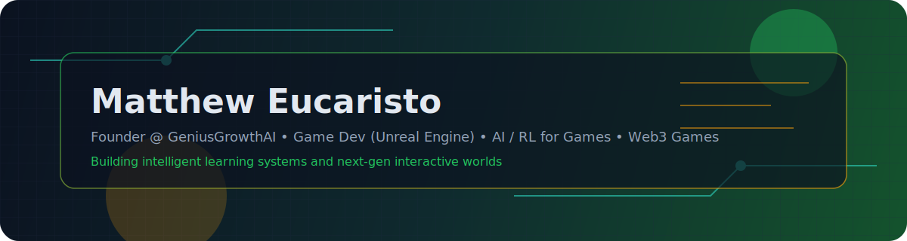

<!-- HERO -->

  

  

  
  
  

  

  Computer Scientist • Game Dev (Unreal Engine) • AI/RL for Games • Web3 Game Systems

  Building intelligent learning systems and next-gen interactive worlds.

  

## About
I am a computer scientist focused on game development and AI. I work on Unreal Engine gameplay systems, research reinforcement learning for games, and explore blockchain-based game economies. I currently lead GeniusGrowthAI, building AI for education.

<table>
  <tr>
    <td width="33%" align="center">
      
       
      Tooling, mechanics, and immersive play loops.
    </td>
    <td width="33%" align="center">
      
       
      Agents, balance, and intelligent behaviors.
    </td>
    <td width="33%" align="center">
      
       
      Ownership, economies, and player-driven systems.
    </td>
  </tr>
</table>

  

## Now
- Founder at GeniusGrowthAI, building AI for education.
- Prototyping a blockchain-based web3 game.
- Continuing research and experiments in RL for games.

## Stack

  

  

## GitHub in motion
<!-- Contribution snake -->
<picture>
  <source media="(prefers-color-scheme: dark)" srcset="https://raw.githubusercontent.com/Matthew-Eucaristo/Matthew-Eucaristo/output/github-snake-dark.svg" />
  <source media="(prefers-color-scheme: light)" srcset="https://raw.githubusercontent.com/Matthew-Eucaristo/Matthew-Eucaristo/output/github-snake.svg" />
  
</picture>

  

## Collaboration
- Research partnerships and applied AI for education.
- Unreal Engine gameplay systems and prototyping.
- Web3 game mechanics, economies, and infra.

  

## Fun
<h3>Need some jokes to cherish your programming workflow?</h3>

## And remember

<!--
Matthew-Eucaristo/Matthew-Eucaristo is a special repository because its README.md appears on your GitHub profile.
-->
