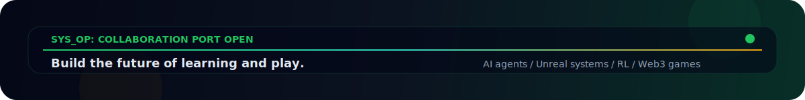

<!-- MATTHEW.SYS PROFILE README -->

<p align="center">
  <a href="https://mattheweuc.vercel.app/">
    
  </a>
</p>

<p align="center">
  <a href="https://mattheweuc.vercel.app/"></a>
  <a href="https://geniusgrowth.ai"></a>
  <a href="https://syntax-gamedev.itch.io/"></a>
  
</p>

<p align="center">
  <a href="https://www.linkedin.com/in/matthew-eucaristo-265127184/">LinkedIn</a> /
  <a href="https://x.com/MatthewEuc">X</a> /
  <a href="https://github.com/Matthew-Eucaristo">GitHub</a> /
  <a href="https://mattheweuc.vercel.app/">Website</a>
</p>

<p align="center">
  
</p>

<p align="center">
  
</p>

## MATTHEW.SYS

```txt
ID: GG-001
ROLE: Co-Founder / CTO @ GeniusGrowthAI
MODE: AI agents, infrastructure, game systems, and learning products
STATUS: ONLINE
```

I build loud systems and quiet foundations: AI agent infrastructure for education, game prototypes with real mechanics, and experiments where reinforcement learning, Unreal Engine, and Web3 systems meet.

## Now

| Signal | Current output |
| --- | --- |
| GG.AI | Running product infrastructure, deployments, and AI agent workflows for GeniusGrowthAI. |
| AI agents | Designing orchestration patterns that make learning systems more useful and adaptive. |
| Games | Prototyping gameplay systems, RL environments, and Unreal Engine mechanics. |
| Web3 | Exploring ownership, economies, and hybrid game loops without losing gameplay-first design. |

<p align="center">
  
</p>

## Field Systems

<table>
  <tr>
    <td width="50%" valign="top">
      <h3>GeniusGrowthAI / GG.AI</h3>
      <p>Co-building the technical side of an AI education platform: agents, DevOps, infrastructure planning, product experiments, and release flow.</p>
      <p><a href="https://geniusgrowth.ai">Visit GeniusGrowthAI</a></p>
    </td>
    <td width="50%" valign="top">
      <h3>Research + Game Tech</h3>
      <p>Reinforcement learning experiments around game environments, including Rainbow DQN work, AI behavior systems, and practical game prototyping.</p>
      <p><a href="https://mattheweuc.vercel.app/">Read the full timeline</a></p>
    </td>
  </tr>
  <tr>
    <td width="50%" valign="top">
      <h3>Unreal Gameplay Systems</h3>
      <p>Mechanics, play loops, game-feel iteration, and prototypes that turn ideas into something playable.</p>
      <p><a href="https://syntax-gamedev.itch.io/">Play the game lab</a></p>
    </td>
    <td width="50%" valign="top">
      <h3>Hybrid Web3 Games</h3>
      <p>Smart contracts, ownership, and player-driven economies designed around gameplay first, not token noise.</p>
      <p><a href="https://github.com/Matthew-Eucaristo?tab=repositories">Browse repositories</a></p>
    </td>
  </tr>
</table>

## University Game Lab

| Phase | Build | Core system |
| --- | --- | --- |
| Sem 2 | LibGDX Space Shooter | Java game loop from scratch |
| Sem 3 | Dijkstra Visualizer | Graph learning game |
| Sem 4 | LWJGL Carnival | Computer graphics environment |
| Sem 5 | Unreal Tower Defense + FPS | Educational gameplay systems |
| Sem 6 | AI Soccer Simulation | Behavior trees, roles, and skills |
| Sem 7 | Web3 PCG Mining Game | Smart contracts + hybrid game integration |
| Sem 8 | Rainbow DQN Thesis | RL environment and agent training |

## Signal Stack

<p align="left">
  
</p>

```txt
PRIMARY: Python, AI agents, infrastructure, DevOps, Unreal Engine, gameplay systems
SECONDARY: C++, Solidity, Next.js, product engineering, Web3 integrations
OPERATING RULE: KISS first. Prove the loop. Then scale it.
```

<p align="center">
  
</p>

## Bingo Mission Board

Visitors can vote on the next public `Matthew.SYS` mission. Click one command, submit the prefilled issue, and GitHub Actions refreshes the board from issue votes.

<!-- mission-board:start -->
<p align="center">
  <strong>Current command:</strong> <code>Awaiting first vote</code> /
  <strong>Total voters:</strong> <code>0</code>
</p>

| Mission | Signal | Unique voters |
| --- | --- | ---: |
| [Deploy GG.AI Infra](https://github.com/Matthew-Eucaristo/Matthew-Eucaristo/issues/new?title=Bingo+Mission%3A+Deploy+GG.AI+Infra&body=Mission%3A+Deploy+GG.AI+Infra%0A%0AI+vote+for+this+Matthew.SYS+mission.) | AI agents + DevOps | 0 |
| [Train RL Game Agent](https://github.com/Matthew-Eucaristo/Matthew-Eucaristo/issues/new?title=Bingo+Mission%3A+Train+RL+Game+Agent&body=Mission%3A+Train+RL+Game+Agent%0A%0AI+vote+for+this+Matthew.SYS+mission.) | Rainbow DQN + game AI | 0 |
| [Prototype Unreal System](https://github.com/Matthew-Eucaristo/Matthew-Eucaristo/issues/new?title=Bingo+Mission%3A+Prototype+Unreal+System&body=Mission%3A+Prototype+Unreal+System%0A%0AI+vote+for+this+Matthew.SYS+mission.) | Gameplay + tooling | 0 |
| [Ship Web3 Game Loop](https://github.com/Matthew-Eucaristo/Matthew-Eucaristo/issues/new?title=Bingo+Mission%3A+Ship+Web3+Game+Loop&body=Mission%3A+Ship+Web3+Game+Loop%0A%0AI+vote+for+this+Matthew.SYS+mission.) | Smart contracts + play | 0 |

<sub>Last vote per GitHub user counts. Last sync: 2026-07-16T14:25:33Z.</sub>
<!-- mission-board:end -->

## GitHub In Motion

<picture>
  <source media="(prefers-color-scheme: dark)" srcset="https://raw.githubusercontent.com/Matthew-Eucaristo/Matthew-Eucaristo/output/github-snake-dark.svg" />
  <source media="(prefers-color-scheme: light)" srcset="https://raw.githubusercontent.com/Matthew-Eucaristo/Matthew-Eucaristo/output/github-snake.svg" />
  
</picture>

<p align="center">
  
</p>

## Manifesto

```txt
KISS. Keep it simple, stupid.
Fear is a signal, not a jailer.
Sit down, lower your head, and do the work.
Own things. Do not let things own you.
The more you control yourself, the less the world controls you.
```

## Collaboration

I am open to research partnerships, applied AI for education, Unreal Engine gameplay systems, Web3 game mechanics, and ambitious prototypes that need both product sense and engineering depth.

<p align="center">
  <a href="https://mattheweuc.vercel.app/">
    
  </a>
</p>

<!--
Matthew-Eucaristo/Matthew-Eucaristo is a special repository because its README.md appears on the GitHub profile.
-->
