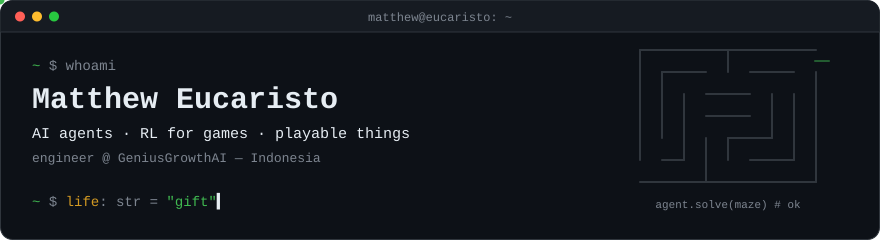

<picture>
  <source media="(prefers-color-scheme: dark)" srcset="assets/header-dark.svg">
  <source media="(prefers-color-scheme: light)" srcset="assets/header-light.svg">
  
</picture>

I build **agents** that act, **RL** that plays games, and **games** people actually play.
Day job: infra and AI agents for an education platform at [GeniusGrowthAI](https://geniusgrowth.ai).
Rule of thumb: keep it simple, measure it, ship it.

### `$ ls ~/projects`

| project | what it is | built with |
| :-- | :-- | :-- |
| [**s1**](https://github.com/Matthew-Eucaristo/s1) | Voice-first macOS agent. A fast local *System 1* acts; an LLM *System 2* is asked only when unsure. Every step gated and logged. `brew install --cask s1` | Swift 6 · AX API · ScreenCaptureKit |
| [**Mouse Maze Mayhem**](https://mouse-maze-mayhem-skripsi.web.app) | My thesis, playable. Four cats vs. one RL mouse in 3D mazes — a solver-distilled policy running in your browser via ONNX. | PyTorch · ONNX · React Three Fiber |
| [**solitaire-rl**](https://github.com/Matthew-Eucaristo/solitaire-rl) | Masked DQN and MaskablePPO learning Klondike, judged on a fixed 1000-deal benchmark. Honest result: the heuristic still wins. | Python · SB3 · Gymnasium |
| [**crypto-cycle-signals**](https://github.com/Matthew-Eucaristo/crypto-cycle-signals) | Futures indicator anchored to BTC's 4-year cycle; every parameter earned by backtest on 68 perps × 6 years. | Pine Script v6 |
| [**Flip10**](https://github.com/Matthew-Eucaristo/Flip10) | Shut the Box, polished: 3D tile flips, procedural audio, offline PWA. [Play →](https://flip10.pages.dev) | Flutter |
| [**Poppp: Rocket Balloon**](https://github.com/Matthew-Eucaristo/GMTKGameJam2024) | GMTK Game Jam 2024 entry — steer a balloon, inflate it by blowing into your mic. [Play →](https://mammamiaaaaa.itch.io/pop-rocket-balloon) | Unreal Engine |

<details>
<summary><code>$ ls ~/archive</code> — university game lab</summary>
<br>

| build | stack |
| :-- | :-- |
| [FOCUS tower defense](https://github.com/Matthew-Eucaristo/FOCUS-Game) · [play](https://syntax-gamedev.itch.io/focus-td) | Unreal Engine 5 |
| [Sliding puzzle](https://github.com/Matthew-Eucaristo/Sliding-Puzzle-UnrealEngine) | Unreal Engine 5 |
| [Shoot The Ghost AR](https://github.com/Matthew-Eucaristo/Shoot-The-Ghost-AR-KelasARVR) · [play](https://syntax-gamedev.itch.io/shoot-the-ghost-ar) | Unreal Engine · AR |
| [Computer graphics final](https://github.com/Matthew-Eucaristo/GrafKom-Final-Project) · [VR sim](https://syntax-gamedev.itch.io/compgraphsimvr) | Java · LWJGL / OpenGL |
| [Solar system](https://github.com/Matthew-Eucaristo/SolarSystemProject-Grafkom) | Java · LWJGL |
| [Guess the Path](https://github.com/Matthew-Eucaristo/Guess-the-Path) | Java · graphs |

</details>

### `$ cat stack.txt`

```txt
ai      pytorch · stable-baselines3 · onnx · llm agents
apps    swift · typescript · react · three.js · flutter · go
games   unreal engine · react three fiber · godot
ops     docker · linux · firebase · cloudflare
```

### `$ ping matthew`

[LinkedIn](https://www.linkedin.com/in/matthew-eucaristo-265127184/) · [X](https://x.com/MatthewEuc) · [itch.io](https://syntax-gamedev.itch.io/) · [mattheweuc.vercel.app](https://mattheweuc.vercel.app/)
